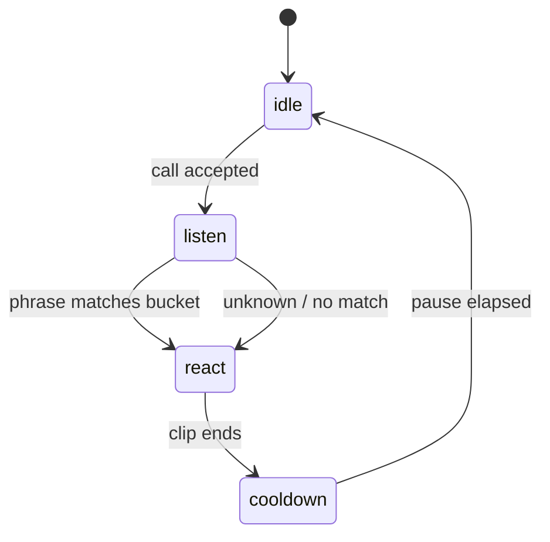

# Clip Library Architecture Plan

This document describes the **dog-facetime-clips** product direction: FaceTime-style memorial calls driven by **prerendered idle and reaction clips**, triggered by spoken phrases. It complements the still-image Ken Burns app in [thorpemark/dog-facetime](https://github.com/thorpemark/dog-facetime).

## Goals (v1)

1. Same call UX as the still app: incoming ring, active call, portrait/landscape framing, share links.
2. **Idle:** loop the dog’s chosen Studio idle MP4 (soft crossfade back after reactions). If no idle is attached, hold the correct identity still — never the colored placeholder slate.
3. **Listen:** Web Speech API (web) / Speech framework (iOS) transcribes speech continuously.
4. **React:** map transcript → **reaction bucket** (meaning + keyword) → **weighted random clip** → crossfade playback → return to idle.
5. **Not** live generative video in the call — only seamless playback of prerendered MP4s.

Murphy, Riley, and **Both** are the first modes. **Riley is the black huskita.** **Murphy is the other dog.** Stills live in `web/public/modes/` (`murphy.jpg` tan/folded ears, `riley.jpg` black-and-white/upright ears, `both.jpg` Murphy left + Riley right). Buckets and phrases should feel natural for how Mark talks to them.

---

## High-level flow



```
Transcript ──► normalize ──► match buckets (meaning + keyword, priority tie-break) ──► bucket id
                                                      │                              (or `unknown` if below threshold)
                                                      ▼
                                            pickWeightedClip(bucket)
                                                      │
                                                      ▼
                                            crossfade to MP4
```

---

## Reaction taxonomy

Each **bucket** is a semantic category with many synonymous **phrases** and several **clip variants**.

| Bucket id | Example phrases | Clip mood (Murphy/Riley) |
|-----------|-----------------|--------------------------|
| `name` | `{dogName}`, "Murphy", "Riley" | Perk up, eye contact |
| `come` | "come here", "c'mere", "here boy" | Head tilt, step forward |
| `good` | "good dog", "good boy", "who's a good" | Happy wag, soft eyes |
| `treat` | "treat", "chicken", "want a cookie", "snack" | Excited, mouth open |
| `walk` | "walk", "go for a walk", "outside" | Alert, tail energy |
| `no` | "no", "no no", "stop that" | Ears back, pause |
| `owner` | `{ownerName}`, "Mark" | Recognition, lean in |
| `here` | "here", "over here", "this way" | Look toward camera |
| `play` | "want to play", "do you want to play", "play", "play fight", "come play" | Play-bow (front low, rear up) + one challenge huff |
| `quiet` | "quiet", "shh", "settle" | Calm down (future) |
| `hug` | "hug", "cuddle" | `touch=cuddly`: loves hug / neck offer. `touch=grumble_hug`: bares teeth, silent warning (Riley-style) |
| `howl` | "howl", "sing" | Murphy: full song. Riley: awkward attempt |
| `halloween` … `labor-day` | "happy halloween", "happy thanksgiving", "merry christmas", "happy birthday", "super bowl", "go birds", … | 10s+ locked-camera costume walk (holiday seed) |
| `unknown` | *(no seed phrases — catch-all)* | Curious head-tilt / silent “huh?” when speech is not recognized |

Buckets are extensible. **`{dogName}`** and **`{ownerName}`** placeholders expand at runtime from memorial profile data.

**Priority:** when multiple buckets are close in score, higher `priority` wins. Content intents (come, treat, …) beat name/owner when the utterance is a command that also contains the dog’s name.

---

## Phrase → bucket matching

The matcher lives in `web/src/utils/matchTranscript.ts` and is wired through `useKeywordSpotter`. Catalog data is the source of truth (`reactionCatalog.ts`); `keyword_rules.json` is a static copy for older clients.

### Pipeline (v2 — shipped)

1. **Normalize** the transcript (lowercase, contractions, punctuation).
2. **Strip** `{dogName}` / `{ownerName}` (and short nicknames like “Murph”) before scoring *content* buckets so “come here Murph” does not get stolen by the name intent.
3. **Keyword fallback:** seed `phrases` with word-boundary matching for short tokens (`no` must not match `know`). Longer phrases use substring includes. This works offline with zero model download.
4. **Meaning / similarity (primary for paraphrases):** each bucket is a document of seed phrases + `semanticHints`. The transcript is scored with:
   - token coverage after a small synonym/alias map (`chicken` → treat, `outside` → walk, `c’mere` → come)
   - character n-gram cosine similarity (TF–IDF over the catalog)
5. **Threshold:** if the best score is below `MATCH_CONFIDENCE_THRESHOLD` (~0.34), or ranking is empty, play the **`unknown` / `confused` head-tilt** — do not stay on idle and do not pick a random other intent. The catch-all bucket is excluded from scoring so it cannot steal a real match.
6. **Tie-break:** near-ties use bucket `priority`. Content buckets get a small preference over name/owner.

Call flow:

```
Transcript ──► matchTranscript ──► bucket id
                                   │
                                   ▼
                         pickWeightedClip(bucket)
                                   │
                                   ▼
                         crossfade to MP4 (or skip if missing)
                                   │
                                   ▼
                         return to idle
```

### Why not Transformers.js on GitHub Pages?

A MiniLM model via Transformers.js / Xenova is ~20MB+ and slow on first load in mobile Safari. For a 10-intent closed set, n-gram + synonym similarity against baked catalog text is the better Pages-friendly approach: no Hugging Face download, works offline, instant. The `matchTranscript` API can later swap in an in-browser embedding model behind the same return type if needed.

There is no private LLM classify endpoint in this repo (no API keys in the web client), so matching stays fully client-side.

Cooldown (~2s) in `useKeywordSpotter` prevents double-firing on partial transcripts.

---

## Weighted randomness within a bucket

Each bucket holds **N ≥ 1** clips with relative **weights** (percents or raw numbers — they are normalized):

```ts
clips: [
  { path: 'clips/reactions/come/come_01.mp4', weight: 40, label: 'Head tilt' },
  { path: 'clips/reactions/come/come_02.mp4', weight: 35, label: 'Eager lean' },
  { path: 'clips/reactions/come/come_03.mp4', weight: 25, label: 'Approach' },
]

const clipPath = pickWeightedClip(bucketId, { excludeLast: true, rng })
```

- Probability(clip) = weight / sum(weights).
- Optional **exclude last played** in the same bucket (renormalize remaining weights).
- Optional `rng` for deterministic tests.
- Demo **localStorage** weight overrides: the `/catalog` page can tweak weights in-browser without editing source. Source of truth remains `reactionCatalog.ts`.

Wire point: `useKeywordSpotter` → `matchTranscript` → `onMatch(bucketId)` → `useMediaPlayback.playReaction(bucketId)` → `pickWeightedClip` → dual-video crossfade. Missing MP4s skip to the next candidate, then idle.

---

## How to add a phrase, clip, or dog

**Preferred:** Clip Studio at `/studio` — no code change. See [`CLIP_STUDIO.md`](CLIP_STUDIO.md).

1. Pick (or add) a dog.
2. **Add intent** / **Add phrase** / **Add clip variant**.
3. Upload a source still → frame (portrait + landscape, crop handles, zoom, rotation).
4. **Suggest prompt** → **Copy** → generate in Grok Imagine (6s · 9:16 for reactions; 10s/15s for holiday costume walks) / Pika / Gemini → **Attach MP4**.
5. Optional `generatorUsed` label only (no live APIs).

Seed templates still live in `web/src/data/reactionCatalog.ts` and are copied into Murphy / Riley / Both on first load. Suggest hug/howl/play + AUDIO lines are composed from each dog’s Studio **Personality** radios (`web/src/utils/suggestClipPrompt.ts`), not from hard-coded dog-name branches.

Missing files fail gracefully: playback tries other variants, then returns to idle. The demo ships bright colored placeholder MP4s so GitHub Pages has *something* visible to play.

### Repo-committed clips (optional)

1. Drop a portrait H.264 MP4 in `web/public/clips/reactions/{bucket}/{bucket}_{nn}.mp4`.
2. Or attach via Studio (IndexedDB in demo mode).
3. Regenerate placeholders: `bash web/scripts/generate-placeholder-clips.sh`.

---

## Clip asset layout

### Static (dev / demo / GitHub Pages)

```
web/public/clips/
  idle/
    idle_01.mp4          # primary loop
    idle_02.mp4          # optional alternates
  reactions/
    come/
      come_01.mp4
      come_02.mp4
      come_03.mp4
    treat/
      treat_01.mp4
      ...
    good/
    walk/
    no/
    name/
    owner/
```

Portrait **720×1280** (9:16) preferred for phone FaceTime simulation. Reuse focal framing concepts from the still app for any letterboxing overlays.

### Supabase Storage (per-memorial, production)

| Object path | Purpose |
|-------------|---------|
| `memorials/{memorialId}/clips/idle/{file}` | Memorial-specific idle loops |
| `memorials/{memorialId}/clips/reactions/{bucket}/{file}` | Reaction variants |
| `memorials/{memorialId}/catalog.json` | Bucket phrase overrides, clip manifest |

**Static vs Supabase:**

| Concern | Static (`public/clips`) | Supabase bucket |
|---------|-------------------------|-----------------|
| Setup | Commit MP4s or CI artifact | Upload via admin script |
| Sharing | One global Murphy/Riley set | Per-memorial clip sets |
| Bandwidth | GitHub Pages CDN | Supabase CDN + RLS |
| v1 recommendation | **Start here** for Mark’s clip generation sprint | Add when memorial-specific clips ship |

RLS: public read for shared memorial clip paths keyed by `share_id`; write only for owner via service role or signed upload URLs.

---

## Playback modes (dual mode)

The web app currently chooses mode in `useMediaPlayback`:

| Condition | Mode | Behavior |
|-----------|------|----------|
| Memorial has uploaded photos | `photos` | Ken Burns + motion presets on keyword (still app) |
| No photos | `video` | MP4 idle + reaction clips |

**Clips fork target:** explicit memorial flag, e.g. `playbackMode: 'photos' | 'clips' | 'both'`.

- `'clips'`: always video library even if photos exist.
- `'both'`: idle = clip loop; reactions = video (photos as optional fallback).
- Default for new memorials in this repo: `'clips'` once assets exist.

Do **not** remove Ken Burns until dual mode is tested — mark TODOs in `useMediaPlayback.ts`.

---

## Generating clips later

Prerender with AI video tools; keep **consistent framing** (same virtual “camera distance”, portrait crop).

Suggested pipeline:

1. **Source:** best portrait stills or short phone video of Murphy/Riley from the still app uploads.
2. **Prompt template per bucket:** e.g. treat → "dog looks excited, mouth slightly open, subtle tail wag, portrait phone framing, natural lighting".
3. **Tools:** Runway Gen-3/Gen-4, Kling, Pika, or image-to-video on key stills.
4. **Post:** trim to 1–3s, H.264, loop-friendly idle segments, normalize loudness if adding audio (usually silent).
5. **Review:** reject clips with morphing artifacts; keep 3–5 variants per bucket.
6. **Import:** drop into `web/public/clips/reactions/{bucket}/` and register paths in `reactionCatalog.ts`.

Naming: `{bucket}_{nn}.mp4` (zero-padded index).

---

## Migration from still memorials

Existing memorials in Supabase store **photo URLs + focal points**, not clips.

| Step | Action |
|------|--------|
| 1 | Add optional `playback_mode` column (`photos` default for legacy rows). |
| 2 | For Murphy/Riley memorials Mark controls, set `playback_mode = 'clips'`. |
| 3 | Upload clip manifest to Storage or ship global catalog in repo. |
| 4 | UI: create flow asks "Photos, clips, or both?" — hide clip option until assets present. |
| 5 | Share links unchanged; viewer picks renderer from memorial metadata. |

Photos remain valid indefinitely in **dog-facetime**; this repo adds clip rendering without breaking shared schema.

---

## iOS parity

`MemorialCall/` already implements idle/react/cooldown with single `clipFileName` per rule. Mirror:

1. `ReactionCatalog.swift` generated or hand-synced from `reactionCatalog.ts`.
2. Random pick in `VideoMixer` / `CallViewModel` on rule match.
3. Bundle structure: `Resources/Clips/reactions/{bucket}/`.

---

## Implementation checklist

- [x] Fork repo + README product split
- [x] `reactionCatalog.ts` with phrases, semantic hints, weighted clip paths
- [x] `pickWeightedClip` + keyword/semantic `matchTranscript`
- [x] `playVideoReaction` uses weighted catalog pick; missing MP4s fall back to idle
- [x] Catalog is source of truth (`keyword_rules.json` kept in sync as a copy)
- [x] Multiple idle clip paths with fallback
- [x] `/catalog` table UI + phrase tester
- [x] Closest-match / meaning scorer with confidence threshold
- [x] `unknown` confused head-tilt catch-all when matching misses (Studio slots + Suggest)
- [x] Clip Studio (`/studio`) — per-dog slots, photo framing, prompts, attach MP4
- [x] Bright placeholder clips + call-loop / video reload fixes
- [ ] `playback_mode` on memorial schema
- [ ] Supabase clip upload + manifest
- [ ] iOS catalog sync

---

## Open questions

1. **Together calls:** split-screen two idle loops, or composite still?
2. **Audio:** silent clips vs subtle ambient paw/collar sounds?
3. **Clip length cap:** hard max 3s for snappy FaceTime feel?

Per-dog catalogs are implemented in Clip Studio (Murphy / Riley / Both seed + Add dog).
